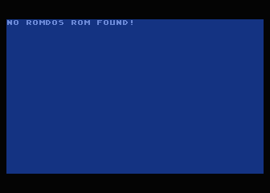

### Atari 8-bit ROMDOS Archive

Archive of Atari 8-bit ROMDOS/RDOS related ROMs and boot disks, including disassembly and new experiments.

---

### TL;DR

Run with atari800 emulator:

``atari800 -nopatch -nopatchall -xl -xlxe_rom romdos-xl-osb.rom -xl-rev custom -cart roms/basicrevc.bin -cart-type 1 atr/romdos.atr``

Or with ``atr/formatted+dupr.atr``, ``romdos-bootcode-dupr.atr`` or ``romdos-singlesector-dupr.atr``

---

### Longer read

__atr/__
  contains the "original" romdos atr and images formatted by it plus helper files

__bootcode/__
  disassembled and annotated boot code, and newly written experimental single sector boot sector

__dat/__
  contains data files, for example the SD 720 sectors ATR header

__roms/__
  ROM dumps, including the 4kB RDOS V0.1 ROM

__/__
  scripts to generate a new "fake" 16kB XL ROM that includes the ROMDOS ROM, ATR images with the original boot code reassembled, and an ATR with the experimental single sector boot code.
  
---
  
### Tools
  
You need a proper Linux/Unix command line or perhaps WSL2 on Windows. Furthermore, you need __mads__ to be able to assemble the 6502 source files.
  
---

### Boot Code

Built from source ``romdos-bootcode-dupr.atr`` is binary identical to a disk formatted by RDOS with three boot sectors and DUPR.SYS written to it.

$ ./build-bootcode-atr.sh   
Writing object file...   
430 lines of source assembled in 3 pass   
384 bytes written to the object file   
Files atr/formatted+dupr.atr and romdos-bootcode-dupr.atr are identical   

---
 
### Experimental Single Sector Boot Disk
  
The experimental single sector boot disk seems to work like any other RDOS disk. Loading and saving files all works. That's good.
  
There is one limitation, though.
It is **NOT** possible to write DOS files to a newly formatted disk
because the single sector boot code is not present in the original ROM.
But the ROMDOS code writes its boot sector mostly from ROM.
Hence the result is not bootable.

Start new single sector disks by making a copy of ``romdos-singlesector-dupr.atr``.
  
Single sector disks only work with ROMDOS present. If it is not found, it will show an error message on screen.
  
---

### TODO

* disect AUTORUN.SYS that is in romdos.atr
* investigate supercart ATR

---

### Screenshots

Booting ``atr/romdos.atr``

Booting ``atr/formatted+dupr.atr``, ``romdos-bootcode-dupr.atr`` and ``romdos-singlesector-dupr.atr``

Booting ``romdos-singlesector-dupr.atr`` without ROMDOS present
  

